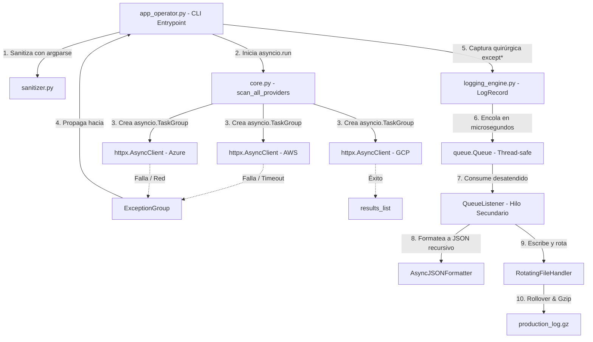

# Proyecto Tritón — TritonMonitor

**TP1 — Sistema de Telemetría Multicloud y Observabilidad Asíncrona**

Programación para Automatización II — Tecnicatura Universitaria en Gestión de Infraestructura Cloud y DevOps

---

## Descripción

`TritonMonitor` es una consola CLI que monitorea, en paralelo, el estado operativo de tres proveedores cloud (AWS, Azure y GCP) mediante peticiones HTTP asíncronas reales. El sistema está diseñado para tolerar fallos de red simultáneos (timeouts, errores HTTP, respuestas corruptas) sin detenerse, registrando cada evento en un pipeline de logging estructurado en JSON, no bloqueante, con rotación y compresión automática de archivos.

## Integrantes y roles

| Rol | Responsabilidad | Archivo(s) | Integrante |
|---|---|---|---|
| 1 | Robustez de Entradas y Excepciones | `exceptions.py`, `sanitizer.py` | Fernández, Ariel Orlando *(completado en reemplazo de la integrante asignada, que no llegó a desarrollarlo)* |
| 2 | Concurrencia y Telemetría Asíncrona | `core.py` | Fernández, Ariel Orlando |
| 3 | Formateo Estructurado JSON | `logging_engine.py` (formatter) | Chumancero, Rene |
| 4 | Almacenamiento No Bloqueante | `logging_engine.py` (pipeline) | Alves Pinto Salto, Clelia Bexamia |
| 5 | Coordinador de Integración y CLI | `app_operator.py` | Díaz, Francisco Amín |

## Estructura del proyecto

```
triton-monitor/
├── src/
│   ├── triton_telemetry/
│   │   ├── __init__.py         # Expone la API pública del paquete
│   │   ├── exceptions.py       # Excepciones semánticas custom de Tritón
│   │   ├── sanitizer.py        # Validación de parámetros CLI (argparse)
│   │   ├── core.py             # Lógica asíncrona de consulta HTTP (asyncio + httpx)
│   │   └── logging_engine.py   # Formateador JSON y pipeline asíncrono no bloqueante
│   └── app_operator.py         # Punto de entrada CLI ejecutable (argparse + except*)
├── requirements.txt            # Dependencias del proyecto
├── .gitignore
└── README.md
```

## Diagrama de arquitectura

El siguiente flujo ilustra cómo interactúan las corrutinas asíncronas de telemetría, el agrupamiento de excepciones concurrentes, la cola segura en memoria y el formateador recursivo JSON para persistir los volcados comprimidos:



## Requisitos

- Python 3.12 o superior (se recomienda 3.14, usado en desarrollo)
- Dependencia declarada en `requirements.txt`:

```
httpx>=0.27.0
```

## Instalación

Clonar el repositorio e instalar la dependencia:

```bash
git clone https://github.com/prog-automatizacion-2-2026/triton-monitor.git
cd triton-monitor
pip install -r requirements.txt
```

_(Opcional)_ Si preferís aislar la dependencia en un entorno virtual:

```bash
python -m venv venv
.\venv\Scripts\Activate.ps1     # Windows
pip install -r requirements.txt
```

## Uso

### Escenario A — Operación nominal

Consulta AWS y GCP en paralelo con un timeout seguro:

```bash
python src/app_operator.py AWS GCP -c cluster-us-east-01 -t 3.0
```

**Comportamiento esperado:** las llamadas asíncronas se ejecutan en paralelo. La consola muestra el reporte nominal con las latencias reales obtenidas de JSONPlaceholder.

### Escenario B — Validación temprana de argumentos fallida

```bash
python src/app_operator.py AWS GCP -c cluster-invalido-id -t 9.5
```

**Comportamiento esperado:** `argparse` atrapa el `ArgumentTypeError` devuelto por `sanitizer.py` antes de iniciar cualquier conexión a internet, aborta la ejecución e imprime la ayuda autogenerada, saliendo con código de retorno 2.

### Escenario C — Inyección de caos

```bash
python src/app_operator.py AWS Azure GCP -c cluster-us-west-02 -t 1.5 --chaos
```

**Comportamiento esperado:** se fuerzan fallos reales y simultáneos (timeout en AWS, error 504 en Azure, payload corrupto en GCP vía httpbin). El `TaskGroup` agrupa los fallos en un `ExceptionGroup`, procesado selectivamente por los bloques `except*`. Las notas forenses (`add_note()`) se muestran en consola, y el evento queda registrado en `triton_services.log`.

## Registro de logs

Cada ejecución genera (o continúa) el archivo `triton_services.log` en la raíz del proyecto, con cada evento en formato JSON estructurado (timestamp ISO 8601 UTC, nivel, logger, mensaje y, ante errores, el árbol completo de excepciones anidadas). El archivo rota automáticamente al superar 2 MB, manteniendo hasta 3 backups comprimidos en `.gz`.

```bash
Get-Content triton_services.log
```

## Notas de seguridad

Este proyecto no requiere ni almacena credenciales ni claves de API: todos los endpoints consumidos (JSONPlaceholder y httpbin) son servicios públicos sin autenticación.
